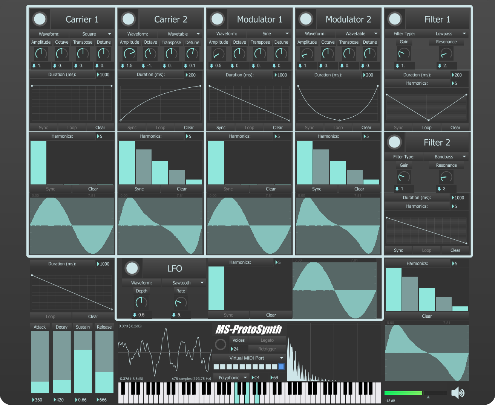

# MS-ProtoSynth 🎹

## Table of Contents

- [Description](#description)
    - [Project](#project)
    - [Repository](#repository)
    - [Technical Details](#technical-details)
- [User Interface](#user-interface)
- [License](#license)

## Description

### Project
**MS-ProtoSynth** integrates techniques of additive, subtractive, AM, FM, and wavetable synthesis to offer endless possibilities of unique digital sounds. This prototype synthesizer features two parallel carrier oscillators whose frequencies are modulated by a pair of two serial modulator oscillators. The outputs of the carriers are then routed through a set of filters, before their combined amplitude is modulated by an LFO and an ADSR envelope. The synthesizer algorithm can be summarized with the following graph:
> Modulator 2 &rarr; Modulator 1 &rarr; [Carrier 1 || Carrier 2] &rarr; [Filter 1 || Filter 2] &rarr; LFO &rarr; ADSR

The polyphonic nature of the synthesizer allows for a configurable number of voices, as the option of voice stealing is disabled by design. Moreover, setting the number of voices to 1 bypasses completely the voice allocation process and enables the use of two exclusive monophonic modes, namely `Legato` and `Retrigger`.

### Repository
The *Max* patches in this repository are located inside the [Source](Source) directory which contains the main patch, referred to as [`UI.maxpat`](Source/UI.maxpat), along with several *Max* abstractions. The main patch serves as the user interface for interacting with the synthesizer's controls, while the other subpatches enable the breakdown of the synthesizer's architecture into smaller, more manageable modules.

### Technical Details
This project was developed using `Max 8.1.11` on `Windows 10` and no forward or backward compatibility with other *Max* versions can be guaranteed. Furthermore, since this is just a prototype, encountering bugs is something to be expected. In the event that an issue occurs, resetting the number of voices should generally resolve the problem.

## User Interface

## License

*MS-ProtoSynth* © *2024* by *Alexandros Iliadis* is licensed under [GNU GPLv3](https://www.gnu.org/licenses/gpl-3.0).

Permissions of this strong copyleft license are conditioned on making available complete source code of licensed works and modifications, which include larger works using a licensed work, under the same license. Copyright and license notices must be preserved. Contributors provide an express grant of patent rights.

See the [LICENSE.md](LICENSE.md) file for more details.